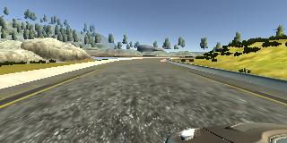
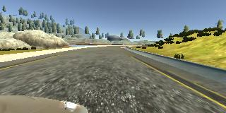

# **Behavioral Cloning** 

---

**Behavioral Cloning Project**

The goals / steps of this project are the following:
* Use the simulator to collect data of good driving behavior
* Build, a convolution neural network in Keras that predicts steering angles from images
* Train and validate the model with a training and validation set
* Test that the model successfully drives around track one without leaving the road
* Summarize the results with a written report

## Rubric Points
### Here I will consider the [rubric points](https://review.udacity.com/#!/rubrics/432/view) individually and describe how I addressed each point in my implementation.  

---
### Files Submitted & Code Quality

#### 1. Submission includes all required files and can be used to run the simulator in autonomous mode

My project includes the following files:
* model.py containing the script to create and train the model
* drive.py for driving the car in autonomous mode
* model.h5 containing a trained convolution neural network 
* writeup_report.md or writeup_report.pdf summarizing the results

#### 2. Submission includes functional code
Using the Udacity provided simulator and my drive.py file, the car can be driven autonomously around the track by executing 
```sh
python drive.py model.h5
```

#### 3. Submission code is usable and readable

The model.py file contains the code for training and saving the convolution neural network. The file shows the pipeline I used for training and validating the model, and it contains comments to explain how the code works.

### Model Architecture and Training Strategy

#### 1. An appropriate model architecture has been employed

My model consists of a convolution neural network with 5x5, 3x3 filter sizes and depths between 24 and 64 (model.py lines 196-206) 

The model includes ELU layers to introduce nonlinearity (code line 196-206). 

#### 2. Attempts to reduce overfitting in the model

The model contains dropout layers in order to reduce overfitting (model.py lines 210). 

The model was trained and validated on different data sets to ensure that the model was not overfitting (code line 266-275). The model was tested by running it through the simulator and ensuring that the vehicle could stay on the track.

#### 3. Model parameter tuning

The model used an adam optimizer, so the learning rate was not tuned manually (model.py line 219).

#### 4. Appropriate training data

Training data was chosen to keep the vehicle driving on the road. I used a combination of center lane driving, recovering from the left and right sides of the road .

For details about how I created the training data, see the next section. 

### Model Architecture and Training Strategy

#### 1. Solution Design Approach

The overall strategy for deriving a model architecture was to use convolution neural network for regression model.

My first step was to use a convolution neural network model similar to the nvidia's architecture. I thought this model might be appropriate because it is actually work and looks reasonable.

In order to gauge how well the model was working, I split my image and steering angle data into a training and validation set. I found that my model training more than 5 epochs, result is not good in autonomous mode, some curve roud can't turn. This implied that the model was overfitting. 

To combat the overfitting, I reduced the epochs so that model performance is better.

The final step was to run the simulator to see how well the car was driving around track one. Awesome, 3 epochs will improve the driving behavior perfectly.

At the end of the process, the vehicle is able to drive autonomously around the track without leaving the road.

#### 2. Final Model Architecture

The final model architecture (model.py lines 188-215) consisted of a convolution neural network with the following layers and layer sizes :

|      Layer      |                   Description                    |
| :-------------: | :----------------------------------------------: |
|      Input      |                  75x320x3 image                  |
| Convolution 1x1 |  1x1 stride, SAME padding, outputs (75, 320, 1)  |
| Convolution 5x5 | 1x1 stride, VALID padding, outputs (71, 316, 24) |
|       ELU       |                                                  |
|   Max pooling   |        2x2 stride,  outputs (35, 158, 24)        |
| Convolution 5x5 | 1x1 stride, VALID padding, outputs (31, 154, 36) |
|       ELU       |                                                  |
|   Max pooling   |        2x2 stride,  outputs (15, 77, 36)         |
| Convolution 5x5 | 1x1 stride, VALID padding, outputs (11, 73, 48)  |
|       ELU       |                                                  |
|   Max pooling   |         2x2 stride,  outputs (5, 36, 48)         |
| Convolution 3x3 |  1x1 stride, VALID padding, outputs (3, 34, 64)  |
|       ELU       |                                                  |
|   Max pooling   |         2x2 stride,  outputs (1, 17, 64)         |
|     Flatten     |                   outputs 1088                   |
| Fully connected |                   outputs 100                    |
|     Dropout     |                                                  |
| Fully connected |                    outputs 50                    |
| Fully connected |                    outputs 10                    |
| Fully connected |                    outputs 1                     |

#### 3. Creation of the Training Set & Training Process

I'm using driving data from udacity provided.

To capture good driving behavior, I'm using center, left and right lane driving image. Here is an example image:






For preprocessing the image, I first crop the top and bottom of the image, make sure image information does not let model confused .


To augment the data sat, I also flipped images and angles randomly thinking that this would recover more cases like left and right sides of the road. For example, here is an image that has then been flipped:


Last step, normalized the image.

After the collection process, I had 24108 number of data sets. 


I finally randomly shuffled the data set and put 20% of the data into a validation set. 

I used this training data for training the model. The validation set helped determine if the model was over or under fitting. The ideal number of epochs was 3 as evidenced by many times training. I tried 5, 8, 10 epochs, lot of times valid loss can't improve anymore when 3 epochs after.So I test 3 epochs, and result is great.  I used an adam optimizer so that manually training the learning rate wasn't necessary.

#### 4.Summary 

Honestly speaking, I am lucky. No much more problems encountered in this project.

One reason is my choose nvidia's awesome model. I just modify a little bit of that, such as Maxpooling, Dropout, especially the first layer I using 1x1 Convolution layer to make the rbg image to grayscale image.

The really important thing is the **data**. I realized that the data is the key for this project, because build model  is simple, preprocessing is regular, Only the quality of the training data determines the outcome of the training.

I thought if after traing driving behavior is bad, then I will collect data myself. Thanks god, the udacity provide's dataset is very useful.

Finally, I use this model to run track two, just begining is well, but always cross the center line, and moving on the left side.Runing a little while then car don't know how to run at the corner.The model generalization ability is not enough.That's acceptable, because I didn't teach it how to run on the double track road.